# Documentación de Diseño — Fluster

**Enlaces referentes**

| Titulo | Enlace |
|---|---|
| Archivo de diseño | [Proyecto — Fluster](https://www.figma.com/design/Jf6d7039UDcHaFClx7Rlby/Proyecto---Fluster?node-id=0-1) |
| Guía de estilos | [Guía de estilos en Figma](https://www.figma.com/design/Jf6d7039UDcHaFClx7Rlby/Proyecto---Fluster?node-id=4-8) |
| Flujo nuevo del Admin | [Ver prototipo](https://www.figma.com/proto/Jf6d7039UDcHaFClx7Rlby/Proyecto---Fluster?node-id=1326-41498&scaling=min-zoom&content-scaling=fixed&page-id=4%3A5&starting-point-node-id=1326%3A41498&show-proto-sidebar=1) |
| Flujo nuevo del Gestor | [Ver prototipo](https://www.figma.com/proto/Jf6d7039UDcHaFClx7Rlby/Proyecto---Fluster?node-id=1332-51219&scaling=min-zoom&content-scaling=fixed&page-id=4%3A5&starting-point-node-id=1332%3A51219&show-proto-sidebar=1) |
| Flujo nuevo del Operador | [Ver prototipo](https://www.figma.com/proto/Jf6d7039UDcHaFClx7Rlby/Proyecto---Fluster?node-id=1332-51923&scaling=min-zoom&content-scaling=fixed&page-id=4%3A5&starting-point-node-id=1332%3A51923&show-proto-sidebar=1) |
| Diagrama de flujo de usuario (FigJam) | [Ver diagrama](https://www.figma.com/board/RElpnz7nwahpUixOCr4vMq/Diagrama-de-Flujo---Fluster?node-id=124-651) |
| Sitemap (FigJam) | [Ver sitemap](https://www.figma.com/board/RElpnz7nwahpUixOCr4vMq/Diagrama-de-Flujo---Fluster?node-id=124-484) |
| Pizarra de diagramas — Fluster (FigJam) | [Abrir pizarra completa](https://www.figma.com/board/RElpnz7nwahpUixOCr4vMq/Diagrama-de-Flujo---Fluster?node-id=0-1) |
| Stitch Fluster V2 | [Abrir en Stitch](https://stitch.withgoogle.com/projects/14699353433587435163) |
| Stitch Fluster V1 | [Abrir en Stitch](https://stitch.withgoogle.com/projects/11028040980894472669) |

---

## Índice

1. [Principios de diseño](#1-principios-de-diseño)
   - [Moodboard — dirección visual y emocional](#moodboard--dirección-visual-y-emocional)
   - [Guía de estilos visual](#guía-de-estilos-visual)
2. [Justificación de la paleta de colores](#2-justificación-de-la-paleta-de-colores)
3. [Justificación de la tipografía](#3-justificación-de-la-tipografía)
4. [User flows](#4-user-flows)
   - [Flujos completos por rol](#flujos-completos-por-rol-página-a-página)
   - [Flujo A — Introducir un contenedor (operador)](#flujo-a--introducir-un-contenedor-operador)
   - [Flujo B — Mover un estado del contenedor (gestor)](#flujo-b--mover-un-estado-del-contenedor-gestor)
   - [Flujo C — Editar el rol de un usuario (admin)](#flujo-c--editar-el-rol-de-un-usuario-admin)
5. [Síntesis](#5-síntesis)

---

## 1. Principios de diseño

Fluster es una herramienta **operativa y de control de costes** para terminales y
operadores logísticos. El diseño parte de tres principios que condicionan todas las
decisiones posteriores:

1. **Claridad sobre decoración.** El usuario toma decisiones con consecuencias
   económicas (un contenedor en sobreestadía genera costes diarios). La interfaz
   prioriza la legibilidad del dato y el estado por encima del ornamento.
2. **Estado siempre visible.** El valor central del producto es saber *en qué
   punto del ciclo D&D* está cada contenedor. El color y la jerarquía tipográfica
   se ponen al servicio de comunicar ese estado de un vistazo.
3. **Accesibilidad como requisito, no como extra.** Todos los pares de
   color/texto se verifican contra **WCAG 2.1** (objetivo AAA donde es posible,
   AA como mínimo), y la interfaz funciona en tema claro y oscuro.

Estos principios se materializan en un **sistema de variables único**  que gobierna a la vez Figma y el código, de
modo que diseño e implementación nunca divergen.

### Moodboard — dirección visual y emocional

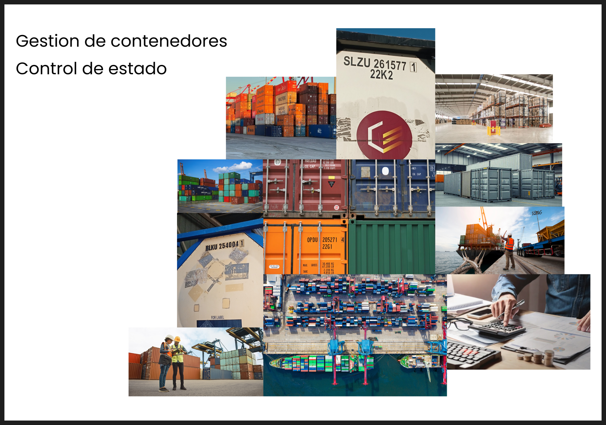

El moodboard —titulado **«Gestión de contenedores · Control de estado»**— fija la
dirección visual y emocional del producto **antes** de definir el color y la tipografía,
y explica de dónde nacen esas decisiones:

- **Mundo marítimo-portuario.** Predominan contenedores apilados, terminales, grúas,
  buques y patios de almacenaje: es el universo real del usuario y la razón de que la
  identidad gire en torno al **azul** (mar, cielo y contenedores) — ver §2.1.
- **El color como estado.** Los contenedores aparecen en múltiples colores (naranja,
  azul, verde, rojo); esa policromía inspira usar el color para **codificar el estado**
  (el semáforo D&D de §2.4), reservando el azul para la marca.
- **El dato central: el código BIC.** Varias imágenes destacan los códigos
  identificativos (p. ej. `SLZU 261577`), el dato que el operador captura por OCR y sobre
  el que se apoya toda la trazabilidad.
- **Operación y control de costes.** Operarios con EPI junto a imágenes de escritorio
  (portátil, calculadora) resumen la doble naturaleza de Fluster: **herramienta de campo**
  y **control económico** de la detención y la sobreestadía.
- **Tono profesional y sobrio.** El conjunto transmite seriedad industrial y fiabilidad,
  coherente con una interfaz **clara y sin ornamento**, centrada en el dato.

En síntesis, el moodboard justifica que Fluster adopte una estética **industrial-marítima,
azul y centrada en el estado**: las decisiones de color (§2) y tipografía (§3) responden a
esta referencia visual.

### Guía de estilos visual

La **guía de estilos** (*style guide*) consolida en un único lienzo todos los fundamentos
del sistema —iconos, tipografía, inputs, bordes/sombras, colores y espaciado— en sus dos
temas. Es la **base** del sistema visual: las secciones de **color (§2)** y **tipografía
(§3)** que siguen **desglosan y justifican** lo que aquí se consolida. Sus valores son
exactamente los `--variables` del sistema, no copias, de
modo que diseño e implementación nunca divergen.

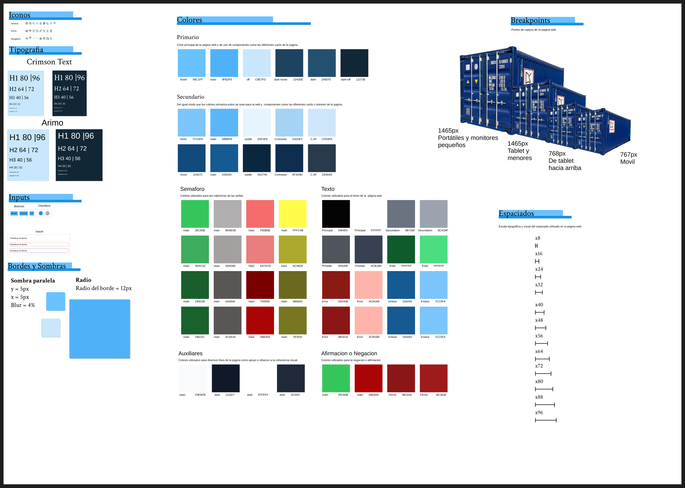

**Por qué es coherente y por qué importa:**

- **Refleja el sistema de variables, no lo duplica.** Los colores (Primario, Texto, Semáforo,
  Auxiliar), la escala tipográfica y los espaciados del lienzo son los mismos valores
  definidos en el sistema (§2, §3): **diseño e implementación nunca
  divergen**.
- **Documenta estados, no solo valores.** Muestra los componentes en sus variantes —botones
  (*hover / default / off*), inputs (normal / error / foco), checkbox—, base de la
  **consistencia interactiva** de toda la app.
- **Doble tema.** La tipografía y los componentes se presentan en **claro y oscuro**,
  evidenciando que el sistema soporta ambos (§2.5) sin excepciones.
- **Escalas compartidas (8px).** Tipografía y espaciado usan el mismo módulo de 8px (§3.3),
  de modo que todo «encaja» en una retícula común.
- **Iconografía catalogada.** Los iconos se agrupan por uso (*General · Action ·
  Navigation*) formando un set coherente; exportados con `currentColor`, heredan el color
  del texto y se adaptan al tema.
- **Bordes y sombras estandarizados.** Radio de **12px** y una escala de sombra única que
  fijan el «grano» visual de tarjetas, inputs y modales en todo el producto.

En conjunto, la guía de estilos es la **prueba de consistencia**: si una pantalla usa algo
que no aparece aquí, se sale del sistema. Por eso cada flujo (§4) puede justificarse «según
lo declarado», porque *lo declarado* vive, visualmente, en este lienzo.

---

## 2. Justificación de la paleta de colores

### 2.1 El azul como color de marca

El color principal de Fluster es un **azul (`#4FB2F8`)**. La elección no es estética
sino semántica:

- **Dominio marítimo.** El azul es el color del mar y del transporte por
  contenedor; conecta de inmediato con el sector sin necesidad de explicación.
- **Confianza y formalidad.** En productos de gestión y *fintech*-logística el
  azul transmite fiabilidad y serenidad, apropiado para una herramienta que maneja
  costes y decisiones operativas.
- **Neutralidad cromática.** Al reservar el rojo, el amarillo y el verde para la
  **señalización de estado** (ver §2.4), la marca necesitaba un color que *no*
  compitiera con esa semántica. El azul cumple ese papel.

| variables | Claro | Oscuro | Uso |
|---|---|---|---|
| `--color-primary` | `#4FB2F8` | `#245070` | Botones primarios, enlaces activos, fondo de header/footer |
| `--color-primary-hover` | `#69C1FF` | `#1D435E` | Estado *hover* |
| `--color-primary-off` | `#C8E7FD` | `#122736` | Deshabilitado, anillos de foco |

### 2.2 Rampa monocromática primario / secundario

Los colores secundarios **comparten el mismo tono azul** que el primario y solo
varían en luminosidad. Esto se decidió deliberadamente para lograr **cohesión
visual** (un único color de marca, no una paleta dispersa) manteniendo a la vez la
jerarquía entre acciones primarias y superficies secundarias (botones, tarjetas de
semáforo, contenedor y usuario).

| Variable | Claro | Oscuro | Contraste verificado |
|---|---|---|---|
| `--color-secondary` | `#5BB6F8` | `#155A93` | **AAA** — 9.3:1 (claro, texto oscuro) · 7.2:1 (oscuro, texto blanco) |
| `--color-secondary-hover` | `#7CC5FA` | `#114A7C` | — |
| `--color-secondary-subtle` | `#E6F4FE` | `#0A2740` | Tintes de fondo muy suaves |

> **Por qué importa:** un mismo azul reutilizado en distintas luminosidades evita la
> sensación de "interfaz de colores aleatorios" y refuerza la identidad, mientras la
> diferencia de luminancia mantiene la separación funcional entre niveles.

### 2.3 Fondos, superficies y texto

Se emplea una base **gris muy neutra** (casi blanca en claro, casi negra en oscuro)
para que el azul de marca y los colores de estado destaquen sin ruido de fondo.

| Variable | Claro | Oscuro | Uso |
|---|---|---|---|
| `--color-bg` | `#F9FAFB` | `#111827` | Fondo de página |
| `--color-surface` | `#FFFFFF` | `#1F2937` | Tarjetas, paneles, modales |
| `--color-text` | `#111827` | `#F9FAFB` | Texto principal |
| `--color-text-subtle` | `#6B7280` | `#9CA3AF` | Texto secundario / metainformación |
| `--color-border` | `#E5E7EB` | `#374151` | Separadores y divisores |

### 2.4 Colores semánticos — el semáforo D&D

El núcleo funcional de Fluster es comunicar el **riesgo de cada contenedor respecto a
los días de detención y demora (D&D)**. Para ello se adopta la metáfora universal del
**semáforo**, que no requiere aprendizaje: cualquier usuario interpreta verde →
amarillo → rojo sin instrucciones.

| Estado | Variable | Color | Significado |
|---|---|---|---|
| Sin costes | `--color-sin_costes` |  `#35C65B` | Dentro del período gratuito |
| Primer tramo | `--color-primer_tramo` |  `#FFFC4B` | Próximo al límite de días libres |
| Segundo tramo | `--color-segundo_tramo` |  `#F66B6B` | En sobreestadía, generando costes |
| Inactivo | `--color-inactivo` |  `#B0AEAE` | Contenedor sin ciclo activo |

> **Decisión clave de accesibilidad:** estos cuatro colores están pensados como
> **fondo** (con texto encima). Para **texto** sobre fondos neutros se definen variables
> *theme-aware* independientes y verificados —`--color-error-text` (`#8A1A14` / `#FFB4AB`),
> `--color-success-text` (`#0E5C2B` / `#4ADE80`), `--color-enlace` (`#155A93` / `#7CC5FA`)—
> porque el rojo y el verde del semáforo, óptimos como fondo, **no alcanzaban el
> contraste mínimo como texto**. Separar "color de estado" de "color de texto" es lo
> que permite cumplir WCAG en ambos roles.

Para las etiquetas de error con texto blanco se usa además un rojo oscurecido
(`--color-error-fondo`, `#9E1B1B`, **AAA 8.0:1**), ya que el rojo del semáforo (`#F66B6B`)
quedaba en ≈2.9:1 sobre texto blanco.

### 2.5 Sistema de temas claro / oscuro

Toda variable de color se expone como **propiedad CSS personalizada** (`--color-*`) en
`:root`. Cambiar de tema solo reescribe esas variables en el nodo raíz; ningún
componente necesita lógica adicional. La resolución del tema sigue tres niveles de
prioridad:

1. **`[data-theme]`** explícito (elección del usuario, persistida en `localStorage`).
2. **`prefers-color-scheme`** del sistema operativo (fallback sin JS).
3. **Valores por defecto** de `:root` (tema claro base).

> **Por qué dos temas:** el personal de terminal trabaja en jornadas largas y en
> entornos de iluminación variable (oficina, exterior, cabina). El modo oscuro reduce
> la fatiga visual y el consumo en pantallas OLED, y la preferencia se respeta de
> forma automática.

### 2.6 Resumen de la justificación cromática

- **Un solo tono de marca** (azul) → identidad cohesionada y "espacio cromático" libre
  para la señalización.
- **Verde/amarillo/rojo/gris** reservados a estado → lectura instantánea del riesgo D&D.
- **Variables de texto separadas de las de fondo** → cumplimiento WCAG AA/AAA en los dos
  temas, comprobado par a par.

---

## 3. Justificación de la tipografía

Fluster combina **dos familias** con roles bien diferenciados:

| Rol | Familia | Variable | Clasificación |
|---|---|---|---|
| Títulos (`h1`–`h6`) | **Crimson Text** | `--font-heading` | Serif (Google Fonts) |
| Cuerpo, datos, UI | **Arimo** | `--font-body` | Sans-serif (métrica de Arial) |

> Implementación real: `$font-heading: 'Crimson Text', serif` y
> `$font-body: 'Arimo', Arial, sans-serif`, precargadas de forma no
> bloqueante en `index.html`.

### 3.1 Por qué una serif para los títulos

**Crimson Text** es una serif de estilo editorial. En un producto de gestión aporta:

- **Autoridad y seriedad.** Las serifs evocan documentación formal e institucional,
  un tono adecuado para una herramienta que gestiona costes y responsabilidades.
- **Contraste de roles.** Usar serif en títulos y sans en cuerpo crea una jerarquía
  inmediata: el usuario distingue "encabezado" de "dato" por la *forma* de la letra,
  no solo por el tamaño.

### 3.2 Por qué una sans-serif para el cuerpo y los datos

**Arimo** es una sans-serif métricamente compatible con Arial, optimizada para
pantalla. Se eligió para todo el contenido funcional porque:

- **Legibilidad en alta densidad.** Las tablas de tarifas, los listados de
  contenedores y los formularios muestran mucha información numérica; una sans neutra
  maximiza la legibilidad y minimiza la fatiga.
- **Neutralidad.** No compite con los títulos ni introduce personalidad que distraiga
  del dato.
- **Robustez multiplataforma.** Al compartir métricas con Arial, el texto mantiene su
  maquetación aunque la fuente web tarde en cargar (evita *layout shift*).

### 3.3 Escala tipográfica de base 8 px

Los tamaños son múltiplos de 8 px (`0.5rem`), **el mismo módulo que el sistema de
espaciado**. Esta coherencia hace que tipografía y maquetación "encajen" en una
retícula común.

| Variable | px | Uso típico |
|---|---|---|
| `--text-12` | 12 | Cabeceras de tabla, texto auxiliar |
| `--text-14` | 14 | Texto secundario (hint, error, botones pequeños) |
| `--text-16` | 16 | Cuerpo base |
| `--text-24` | 24 | Subtítulos / énfasis |
| `--text-32` | 32 | Títulos de sección |
| `--text-48` | 48 | Título de página |
| `--text-64` | 64 | Títulos *hero* |

Además se definen tamaños **fluidos** (`clamp()`) para los títulos *hero*, de modo que
escalan suavemente entre móvil y escritorio sin saltos bruscos.

### 3.4 Pesos e interlineado

| Peso | Valor | Uso | | Interlineado | Valor | Uso |
|---|---|---|---|---|---|---|
| `regular` | 400 | Cuerpo | | `tight` | 1.2 | Títulos grandes |
| `medium` | 500 | Labels de formulario | | `snug` | 1.35 | Subtítulos |
| `semibold` | 600 | Títulos de componente, botones | | `normal` | 1.5 | Cuerpo |
| `bold` | 700 | Títulos de página, valores destacados | | `relaxed` | 1.75 | Lectura larga |

> **Justificación:** cuatro pesos y cuatro interlineados bastan para construir toda la
> jerarquía sin sobrecargar el sistema. Interlineados más amplios (1.5–1.75) en el
> cuerpo favorecen la lectura de párrafos; más ajustados (1.2) en títulos evitan que
> ocupen un espacio vertical excesivo.

---

## 4. User flows

Los tres flujos documentados representan **la tarea principal de cada uno de los tres
roles** del sistema, demostrando que el diseño cubre el ciclo completo del producto:

| Flujo | Rol | Tarea | Pantalla clave |
|---|---|---|---|
| **A** | Operador | Dar de alta un contenedor | Meter contenedor (OCR) |
| **B** | Gestor | Avanzar el estado D&D de un contenedor | Semáforo |
| **C** | Administrador | Cambiar el rol de un usuario | Panel de control |

El acceso a cada pantalla está protegido por rol (`RutaProtegida`), de modo que cada
flujo solo es accesible para el rol que lo necesita.

### Flujos completos por rol (página a página)

Además de los tres flujos de tarea (A/B/C) descritos abajo, cada rol tiene documentado su
**recorrido completo, pantalla a pantalla**, justificando en cada página su **coherencia y
consistencia visual** y su **estructura de la información**:

| Rol | Páginas | Documento |
|---|---|---|
| **Operador** | Home · Registro · Login · Contenedores · Meter contenedor · Perfil | [flujos/operador/operador.md](flujos/operador/operador.md) |
| **Gestor** | Home · Registro · Login · Semáforo · Tarifas · Almacén · Historial · Perfil | [flujos/gestor/gestor.md](flujos/gestor/gestor.md) |
| **Administrador** | Home · Login · Panel de control · Perfil | [flujos/admin/admin.md](flujos/admin/admin.md) |

>**Mapas visuales (FigJam):** los recorridos están en el
> [Diagrama de Flujo — Fluster](https://www.figma.com/board/RElpnz7nwahpUixOCr4vMq/Diagrama-de-Flujo---Fluster?node-id=124-651),
> la **estructura de navegación** del producto en el
> [Sitemap](https://www.figma.com/board/RElpnz7nwahpUixOCr4vMq/Diagrama-de-Flujo---Fluster?node-id=124-484),
> y la **funcionalidad** (qué hace cada parte de la app) en el
> [mapa de Funcionalidad](https://www.figma.com/board/RElpnz7nwahpUixOCr4vMq/Diagrama-de-Flujo---Fluster?node-id=124-403).

---

### Flujo A — Introducir un contenedor (operador)

| | |
|---|---|
| **Rol** | Operador |
| **Objetivo** | Registrar una nueva unidad en el sistema con el mínimo esfuerzo y error |
| **Prototipo** | [Prototipo A navegable](https://www.figma.com/proto/Jf6d7039UDcHaFClx7Rlby/Proyecto---Fluster?node-id=1326-10042&scaling=min-zoom&content-scaling=fixed&page-id=4%3A5&starting-point-node-id=1326%3A10042) |

**Recorrido paso a paso**

**Paso 1 · Inicio (Home del operador)**

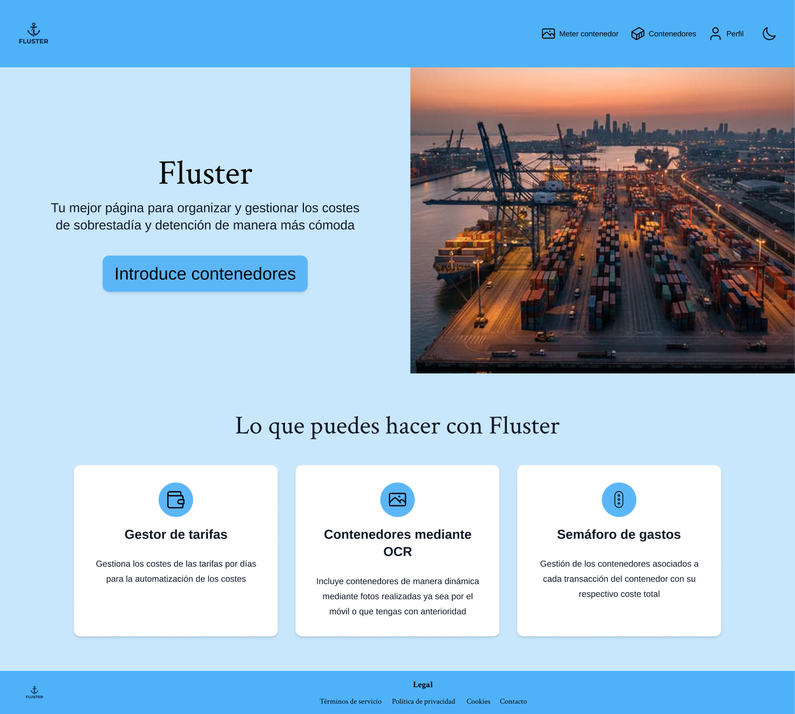

Tras iniciar sesión, el operador aterriza en su página de inicio. El *hero*
**«Introduce contenedores»** y el menú superior (**Meter contenedor · Contenedores ·
Perfil**) son los puntos de entrada a la tarea. El bloque «Lo que puedes hacer con
Fluster» recuerda, entre las capacidades, el alta de **contenedores mediante OCR**.

**Paso 2 · Listado de contenedores**

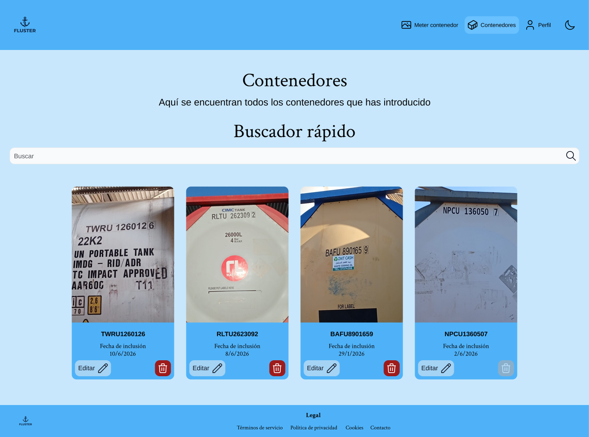

El operador abre **Contenedores** y ve las unidades que ya ha registrado, con un
**Buscador rápido** para localizarlas. Para dar de alta una nueva, pulsa **«Meter
contenedor»** en el menú.

**Paso 3 · Pantalla de alta (elección de vía)**

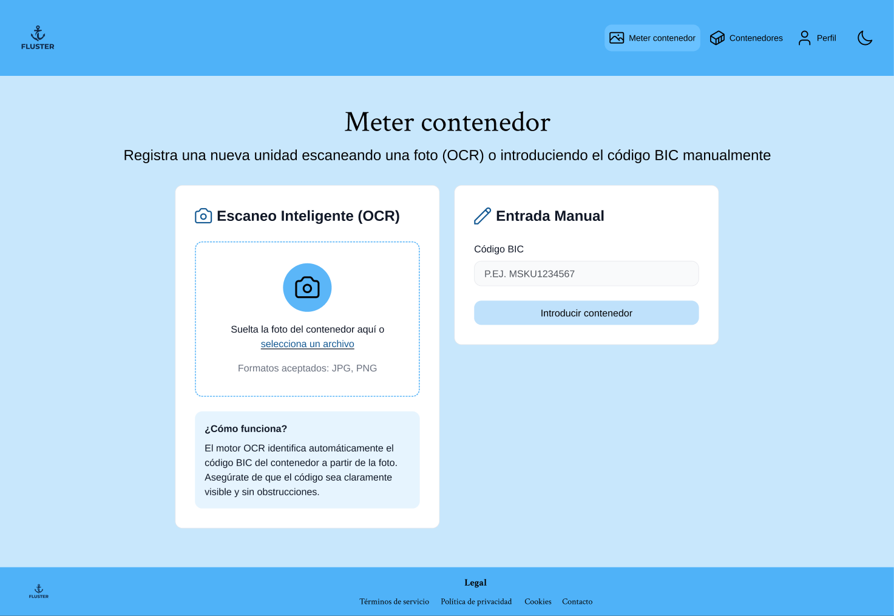

La pantalla ofrece **dos vías paralelas**: **Escaneo Inteligente (OCR)** —arrastrar o
seleccionar una foto JPG/PNG— y **Entrada Manual** —teclear el código BIC—. El bloque
«¿Cómo funciona?» orienta al usuario. El operador elige el escaneo y **suelta la foto
del contenedor** en la zona punteada.

**Paso 4 · Verificación del código detectado**

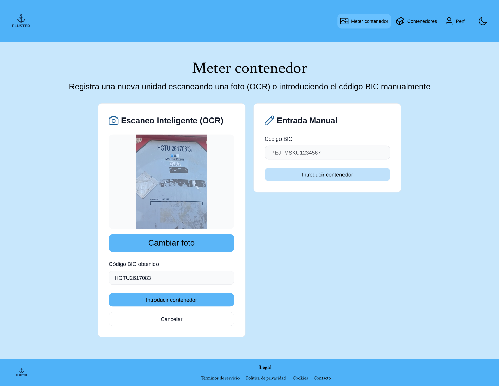

El sistema muestra la **previsualización de la foto** y rellena automáticamente el campo
**«Código BIC obtenido»** (en el ejemplo, `HGTU2617083`). El campo es **editable** para
corregir cualquier carácter mal reconocido; el operador lo verifica y pulsa
**«Introducir contenedor»** (o «Cambiar foto» / «Cancelar» para rehacer).

**Paso 5 · Contenedor registrado**

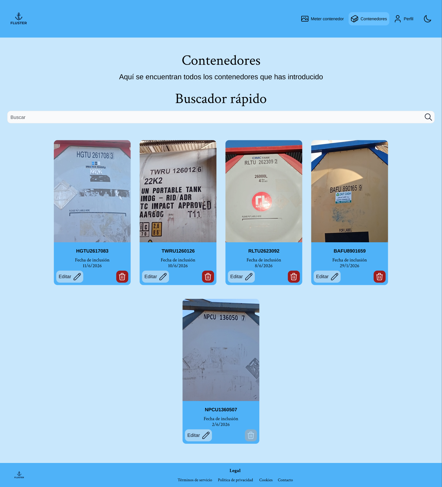

Al confirmar, la aplicación devuelve al operador a su listado, ahora con la **nueva
unidad ya incluida** (`HGTU2617083`), cerrando el bucle de la tarea.

**Justificación UX**

- **Reducción de error y esfuerzo.** El código BIC son 11 caracteres alfanuméricos;
  teclearlos a mano es lento y propenso a errores. El OCR convierte una tarea de
  transcripción en una de *verificación*, más rápida y fiable.
- **Tolerancia a fallos.** Si el OCR no detecta nada, el campo no se bloquea: degrada
  con elegancia a entrada manual, sin callejones sin salida.
- **Feedback de carga.** Durante el procesado se muestra el estado *"Detectando…"*,
  cumpliendo el principio de *visibilidad del estado del sistema*.

---

### Flujo B — Mover un estado del contenedor (gestor)

| | |
|---|---|
| **Rol** | Gestor |
| **Objetivo** | Avanzar un contenedor entre tramos del ciclo D&D y ver el impacto en el semáforo |

| **Prototipo** | [Prototipo B navegable](https://www.figma.com/proto/Jf6d7039UDcHaFClx7Rlby/Proyecto---Fluster?node-id=1335-56449&scaling=min-zoom&content-scaling=fixed&page-id=4%3A5&starting-point-node-id=1335%3A56449) |

**Recorrido paso a paso**

**Paso 1 · Inicio (Home pública)**

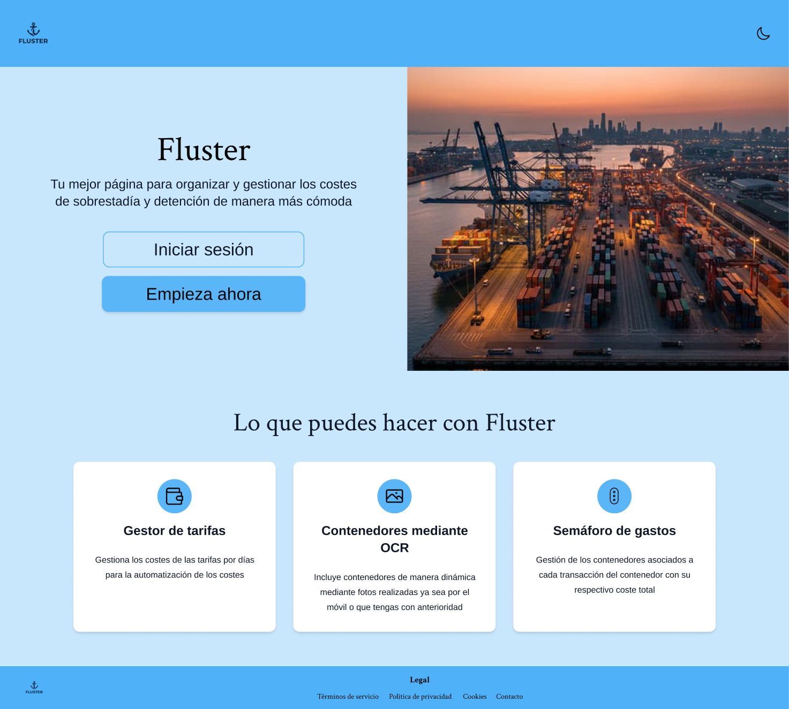

El gestor llega a la página pública de Fluster y pulsa **«Iniciar sesión»** (o «Empieza
ahora») para acceder.

**Paso 2 · Iniciar sesión**

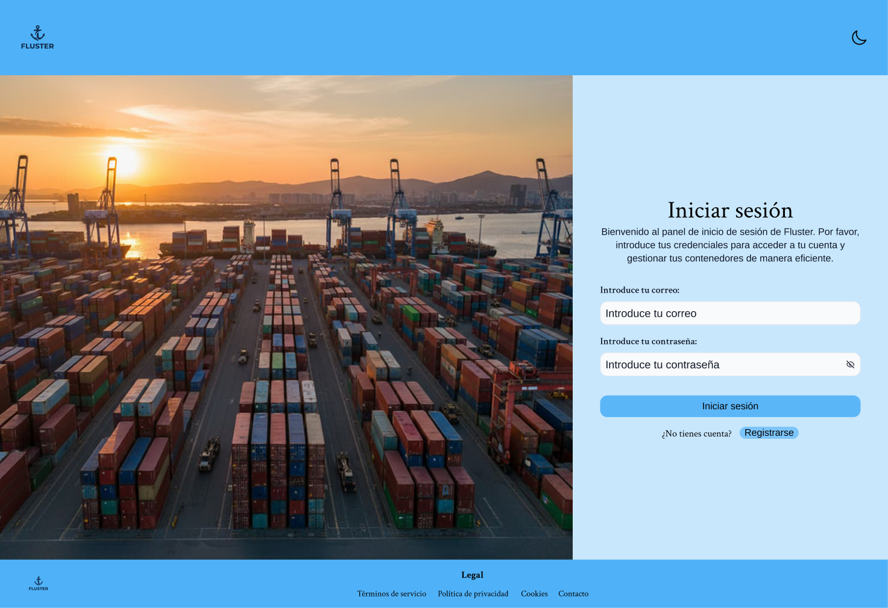

Introduce su **correo** y **contraseña**. Al autenticarse con rol de gestor, el sistema
lo dirige a su área de trabajo.

**Paso 3 · Semáforo — estado de los contenedores**

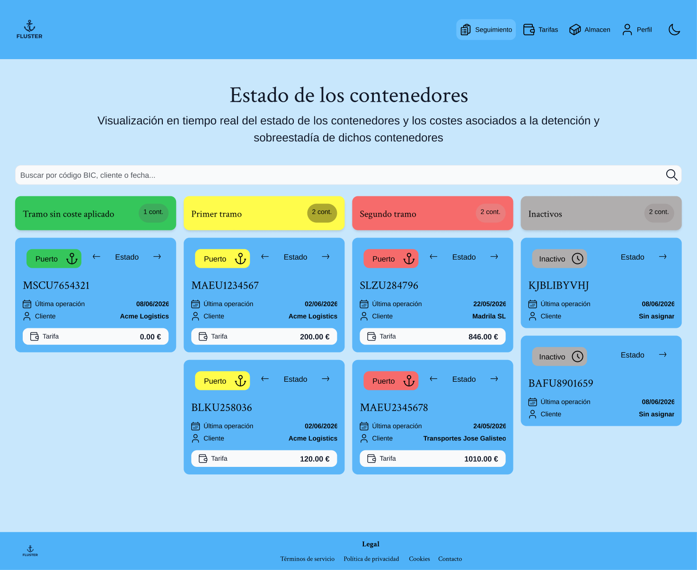

Vista central del gestor: los contenedores aparecen **agrupados por nivel de riesgo
D&D** en columnas de color —**sin coste aplicado** (verde), **primer tramo** (amarillo),
**segundo tramo** (rojo) e **inactivo** (gris)—, cada uno con su coste asociado. Es la
materialización directa de la metáfora cromática descrita en §2.4. Para avanzar una
unidad, el gestor usa los **controles de estado de su tarjeta**.

**Paso 4 · Estado movido (tablero actualizado)**

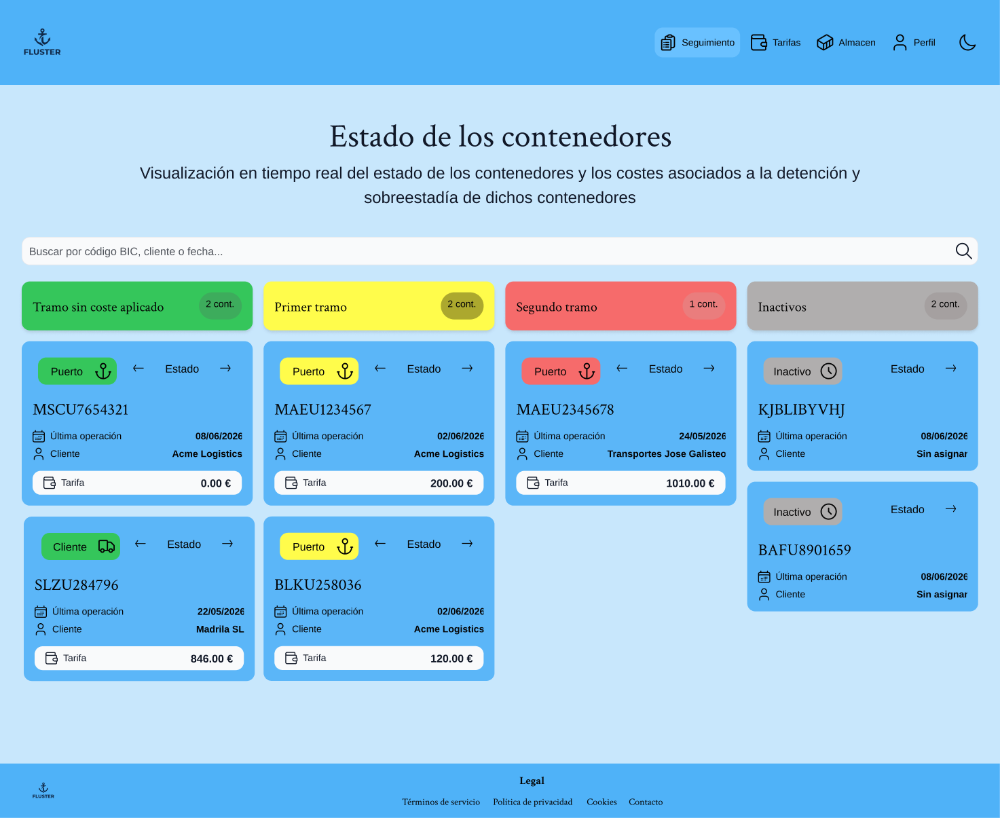

Al mover el contenedor, el tablero lo **recoloca en la columna del nuevo tramo** y
actualiza al instante su color y su coste asociado, reflejando el nuevo nivel de riesgo
sin recargar la página.

**Justificación UX**

- **El color *es* la información.** Agrupar por estado y colorear cada columna permite
  evaluar la situación global de la cartera de contenedores **de un vistazo**, sin
  leer fechas ni hacer cálculos.
- **Coherencia con el modelo mental.** "Mover" un contenedor de columna refleja
  físicamente lo que ocurre en el negocio (la unidad avanza en su ciclo), reduciendo la
  carga cognitiva.
- **Acceso por rol.** El semáforo es competencia del gestor; el control de acceso evita
  que un operador altere estados que no le corresponden.

---

### Flujo C — Editar el rol de un usuario (admin)

| | |
|---|---|
| **Rol** | Administrador |
| **Objetivo** | Gestionar permisos cambiando el rol asignado a un usuario |
| **Diseño** | [Flujo C en Figma](https://www.figma.com/design/Jf6d7039UDcHaFClx7Rlby/Proyecto---Fluster?node-id=1335-52693) |
| **Prototipo** | [Prototipo C navegable](https://www.figma.com/proto/Jf6d7039UDcHaFClx7Rlby/Proyecto---Fluster?node-id=1335-56321&scaling=min-zoom&content-scaling=fixed&page-id=4%3A5&starting-point-node-id=1335%3A56321) |

**Recorrido paso a paso**

**Paso 1 · Inicio (Home pública)**

El administrador accede a la página pública de Fluster y pulsa **«Iniciar sesión»**.

**Paso 2 · Iniciar sesión**

Introduce sus credenciales. Al autenticarse con rol de administrador, el sistema le da
acceso al panel de administración.

**Paso 3 · Panel de control**

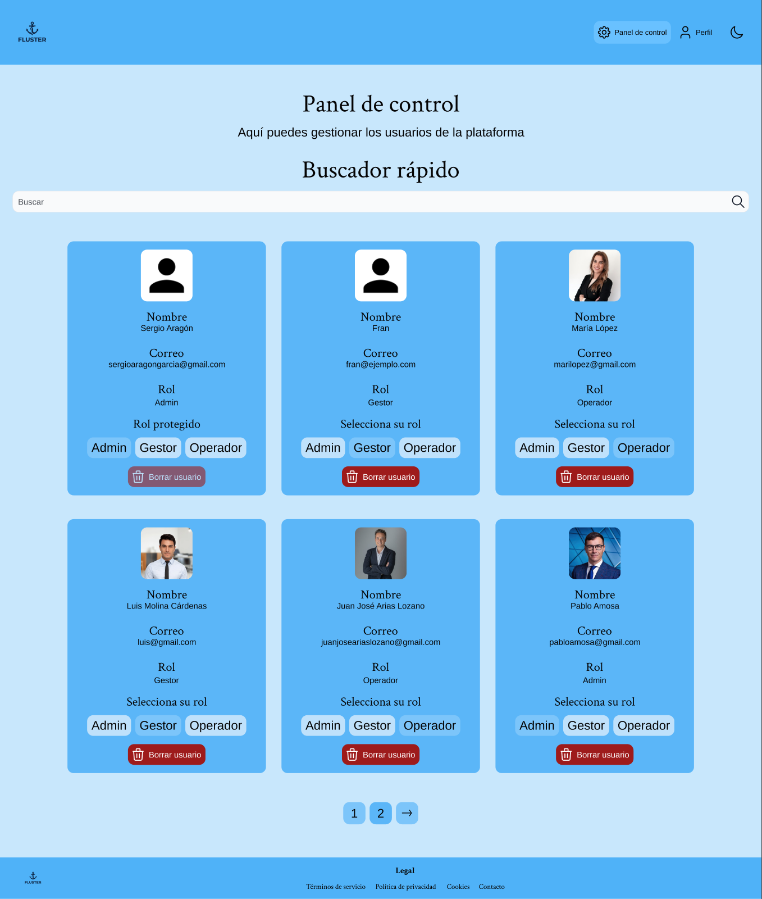

Vista de administración con las **tarjetas de los usuarios** (nombre, correo y rol), un
**Buscador rápido** y, en cada tarjeta, el selector de rol **Admin · Gestor ·
Operador** junto a la acción «Borrar usuario». El administrador dueño aparece marcado
como **«Rol protegido»**, de modo que no puede degradarse ni eliminarse. Para cambiar un
rol, el admin pulsa el botón del rol deseado en la tarjeta del usuario.

**Paso 4 · Rol actualizado**

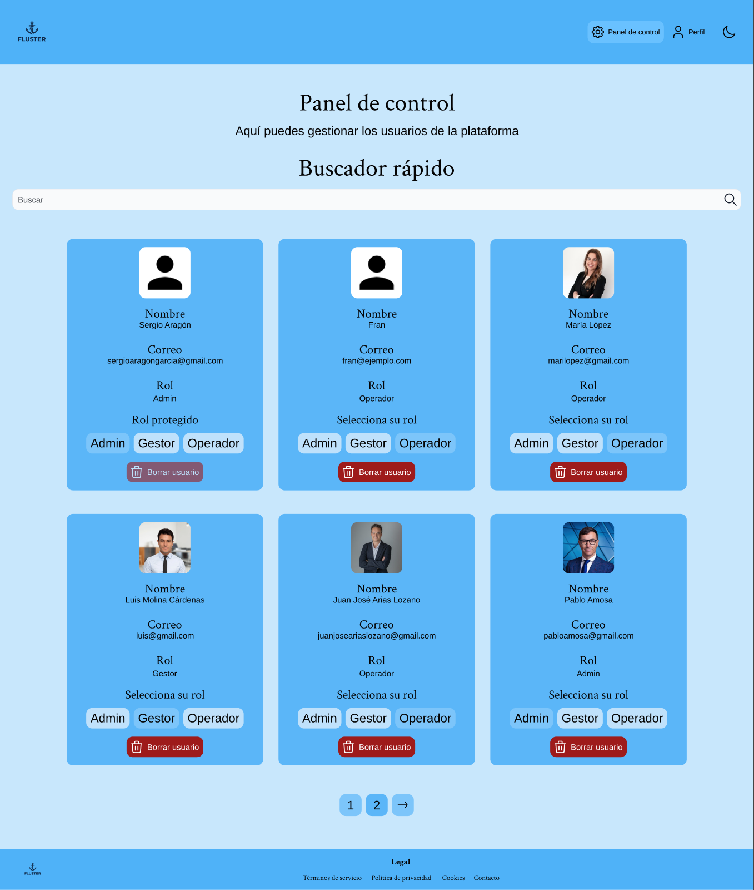

La tarjeta del usuario **refleja el nuevo rol de inmediato**, en la propia vista y sin
recargar, confirmando el cambio de permisos.

**Justificación UX**

- **Modelo de tarjetas.** Representar cada usuario como una tarjeta homogénea facilita
  el escaneo visual y agrupa en un mismo lugar identidad, rol y acciones.
- **Cambios reversibles y visibles.** El rol se actualiza en la propia vista, dando
  confirmación inmediata sin recargar ni perder el contexto.
- **Principio de mínimo privilegio.** Centralizar la asignación de roles en un único
  panel, accesible solo al administrador, es coherente con un control de permisos claro
  y auditable.

---

## 5. Síntesis

El diseño de Fluster es **sistemático y justificable en cada capa**:

- **Color** — un azul de marca que libera el espectro verde/amarillo/rojo para la
  señalización D&D, con variables de texto separadas de las de fondo y contraste WCAG
  verificado en temas claro y oscuro.
- **Tipografía** — pareja serif (Crimson Text) + sans (Arimo) que separa "encabezado"
  de "dato", sobre una escala de 8 px coherente con el espaciado.
- **Flujos** — un *user flow* por rol (operador, gestor, admin) que cubre el ciclo
  completo del producto: **dar de alta**, **mover de estado** y **administrar**.

Todo ello se apoya en un **sistema de variables único** compartido por Figma y el código,
lo que garantiza que la justificación de este documento se corresponde exactamente con
lo que se renderiza en la aplicación.

---
