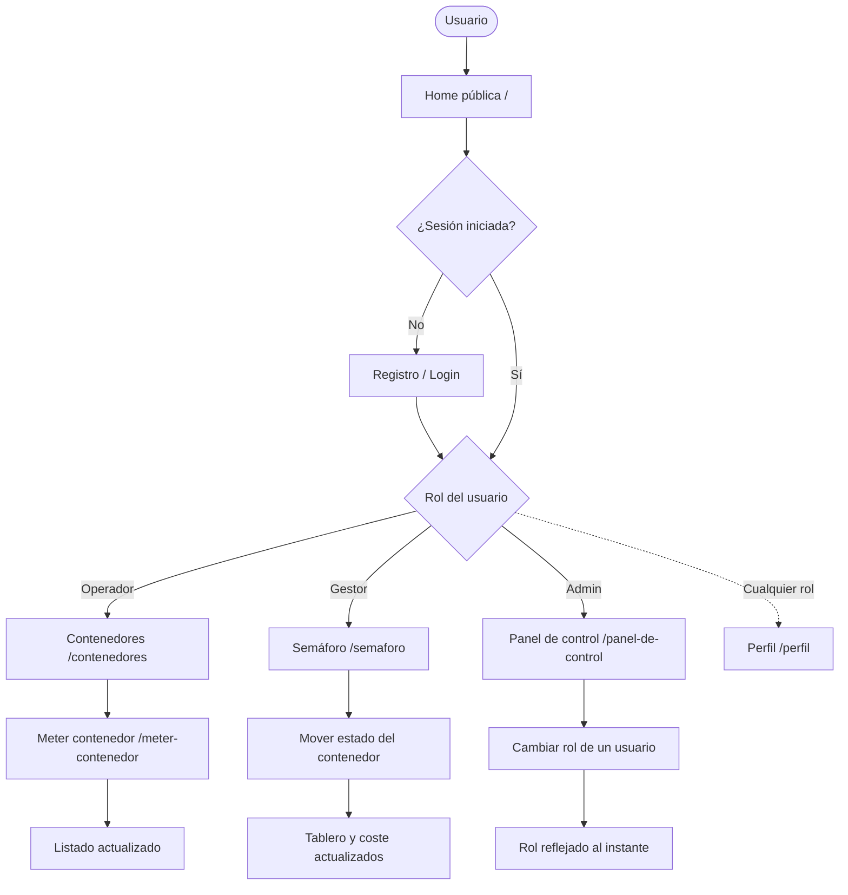

# Arquitectura de uso — Fluster

> Cómo se **usa** Fluster: qué hace cada rol, su recorrido principal y el flujo general de la
> aplicación, desarrollando las **decisiones de diseño** que lo explican. Los recorridos
> completos, pantalla a pantalla, están en [`flujos/`](flujos/); la implementación real es el
> repositorio [Fluster](https://github.com/Agsergio04/Fluster).

---

## 1. La estructura se organiza por roles

La estructura de la aplicación se organiza **por roles**. Esta decisión no solo responde a la
funcionalidad, sino también a la **claridad del producto**: cada perfil ve únicamente las
pantallas que necesita —el acceso a cada vista está protegido por rol— de modo que nadie se
encuentra con tareas que no le corresponden.

Son tres roles, y juntos cubren el ciclo completo del producto: el **operador** da de alta las
unidades, el **gestor** las supervisa y el **administrador** gestiona a las personas. El acceso
sin sesión se limita a la página pública, el registro y el login; la pantalla de **Perfil**
queda disponible para cualquier rol autenticado.

---

## 2. Rol de operador

El operador trabaja **a pie de terminal**: necesita registrar contenedores deprisa y sin
errores. Por eso su punto de entrada es el **listado de contenedores** y el alta asistida por
**OCR**, y no los datos económicos, que no le competen.

Su recorrido principal es este:

1. Login.
2. Acceso a su listado de **Contenedores**.
3. **Meter contenedor**: sube una foto y el OCR extrae el código BIC.
4. Verificación del código y alta del contenedor.
5. El listado se actualiza con la nueva unidad ya incluida.

Este flujo está pensado para que la **consecuencia de una acción sea visible enseguida**:
introducir un contenedor debe traducirse al instante en una nueva tarjeta en el listado,
porque eso refuerza la utilidad de la herramienta. Además, apoyarse en el OCR convierte una
tarea de **transcripción** (teclear 11 caracteres) en una de **verificación**, más rápida y
fiable; y si el reconocimiento falla, el flujo degrada a entrada manual sin callejones sin
salida.

---

## 3. Rol de gestor

El gestor trabaja con otra lógica. No captura unidades, sino que **supervisa el riesgo
económico** de toda la cartera de contenedores y la mantiene al día (tarifas, almacén,
informes). Por eso su pantalla central es el **Semáforo**, un tablero que agrupa los
contenedores por tramo del ciclo D&D.

Su recorrido principal es este:

1. Login.
2. Acceso al **Semáforo**, con los contenedores agrupados por nivel de riesgo.
3. Avance del estado de un contenedor mediante los controles de su tarjeta.
4. El tablero **recoloca** la unidad en su nuevo tramo y actualiza su coste al instante.

La decisión de darle un **tablero por color** —y no una tabla de fechas— busca que pueda leer
la situación global **de un vistazo**, sin cálculos, y que el gesto de «mover» un contenedor
de columna refleje literalmente lo que ocurre en el negocio. Separar este recorrido del
operador evita además mezclar dos tareas distintas —**capturar** unidades y **supervisarlas**—
en una misma interfaz.

---

## 4. Rol de administrador

El administrador no opera contenedores: **gestiona personas y permisos**. Su área es la más
pequeña a propósito, centralizada en un **único panel**.

Su recorrido principal es este:

1. Login.
2. Acceso al **Panel de control** con las tarjetas de usuario.
3. Cambio del rol de un usuario (Admin / Gestor / Operador).
4. La tarjeta refleja el nuevo rol de inmediato, sin recargar.

La decisión de separar este flujo del resto evita **mezclar tareas incompatibles** en una
misma interfaz: la administración de roles es una responsabilidad de sistema, no operativa. Si
conviviera con las vistas de trabajo, el producto perdería foco y sería más difícil de
entender. Centralizarla en un panel accesible solo al administrador la hace **clara y
auditable**, y el administrador dueño queda protegido para no poder degradarse ni eliminarse
(principio de mínimo privilegio).

---

## 5. Flujo general

Visto en conjunto, los tres recorridos **parten del mismo acceso** y se separan por rol en
cuanto hay sesión iniciada. El público solo alcanza la home, el registro y el login; a partir
del rol, cada usuario entra directamente en su área de trabajo:

La lectura del diagrama confirma la idea de fondo: **un acceso común, tres recorridos
separados**. Esa separación es, precisamente, lo que mantiene el producto enfocado y fácil de
entender.
