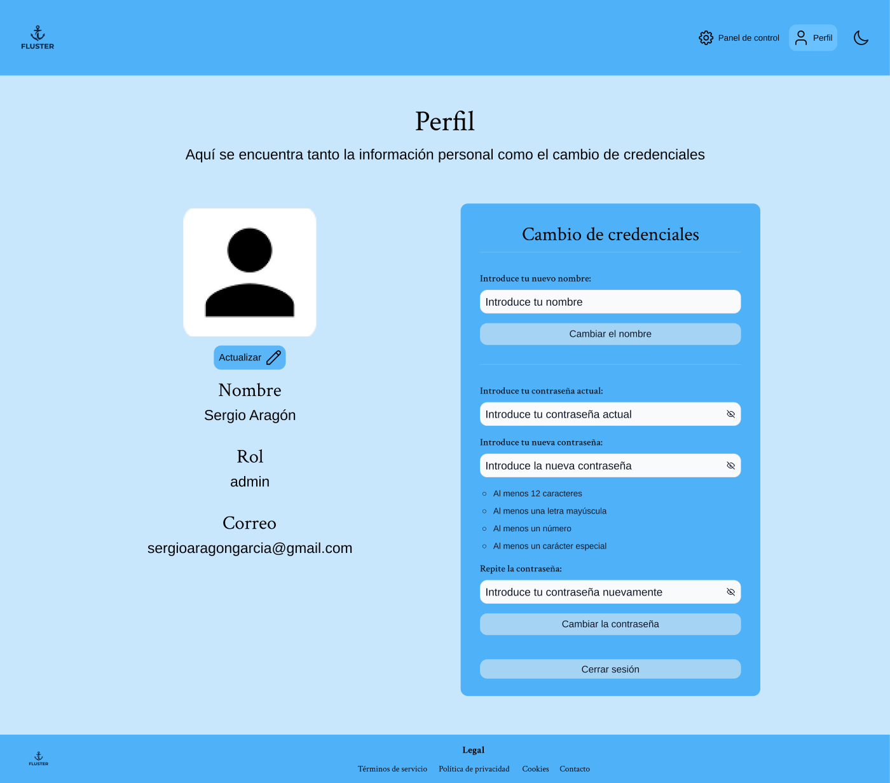

# Flujo completo — Administrador

> Recorrido completo del rol **administrador**, pantalla a pantalla. El admin **gestiona
> los usuarios y sus permisos** en la plataforma. Para cada página se justifica su
> **coherencia y consistencia visual**, su **estructura de la información** y su
> **alineación con el sistema declarado** en el [README principal](../../README.md) (variables
> de color, tipografía, retícula, radio, moodboard…).

**Gramática visual compartida** (base de la *consistencia*): cabecera azul
(`--color-primary`) con logo-ancla + navegación (**Panel de control · Perfil**) e
interruptor de tema; fondo `--color-primary-off`; contenido centrado a máx. **1224px**;
títulos en **Crimson Text** y cuerpo/UI en **Arimo**; tarjetas y paneles con **radio
12px**, sombra suave y color por *variables*; footer azul.

---

## 1 · Inicio (Home pública)

- **Coherencia visual:** misma cabecera, paleta e *hero* en Crimson Text; tarjetas de
  capacidades con radio/sombra estándar.
- **Estructura de la información:** *hero* (propuesta de valor + CTA) y tres tarjetas
  resumen. De lo general a la acción.
- **Según el sistema declarado (README):** *hero* en **Crimson Text** y cuerpo en
  **Arimo**; **azul de marca** `--color-primary`; estética del **moodboard**; **radio 12px** y **escala de 8px**.

## 2 · Iniciar sesión

- **Coherencia visual:** layout partido (imagen de puerto + formulario) con los inputs y
  botones estándar del sistema.
- **Estructura de la información:** formulario mínimo (correo + contraseña) y enlace a
  Registro. Solo lo imprescindible para acceder.
- **Según el sistema declarado (README):** **variables** de input/botón y tipografía; **azul de marca** sobre `--color-primary-off`.

## 3 · Panel de control

- **Coherencia visual:** rejilla de **tarjetas de usuario** homogéneas (`ConjuntoCards`)
  con el mismo radio, sombra y color (`--color-secondary`) que las tarjetas de contenedor o
  semáforo; los botones de rol reutilizan los estilos de botón del sistema.
- **Estructura de la información:** una tarjeta por usuario con su **nombre, correo y rol**,
  el selector **Admin · Gestor · Operador** y la acción «Borrar usuario». El administrador
  dueño aparece marcado como **«Rol protegido»** (no degradable ni eliminable). Buscador
  rápido arriba y paginación abajo. Identidad y acciones agrupadas por tarjeta.
- **Según el sistema declarado (README):** tarjetas en **`--color-secondary`** con
  **radio 12px** sobre la **retícula de 1224px**; nombre en **Crimson** y datos en
  **Arimo**; botones de rol con **variables**; al usar solo variables, hereda sin
  esfuerzo el **tema claro/oscuro**.

## 4 · Perfil

- **Coherencia visual:** dos columnas (identidad + «Cambio de credenciales») idénticas al
  Perfil de operador y gestor salvo los datos; el admin protegido conserva el mismo patrón.
- **Estructura de la información:** identidad (foto + nombre + rol + correo) separada de las
  acciones de cuenta (cambiar nombre, contraseña con requisitos, cerrar sesión).
- **Según el sistema declarado (README):** **variables** + tipografía dual +
  **radio 12px** y escala de 8px; mismos componentes que el resto, prueba del **sistema de
  variables único**.

---

> **Conclusión:** el flujo del admin es el más corto pero **no introduce ninguna excepción
> visual**: reutiliza la cabecera, la retícula de 1224px, la tipografía dual y el patrón de
> tarjetas, y cumple en cada página **lo declarado en el README**. El Panel de control
> demuestra que un módulo de gestión «de sistema» se expresa con **los mismos componentes**
> que las vistas operativas.
