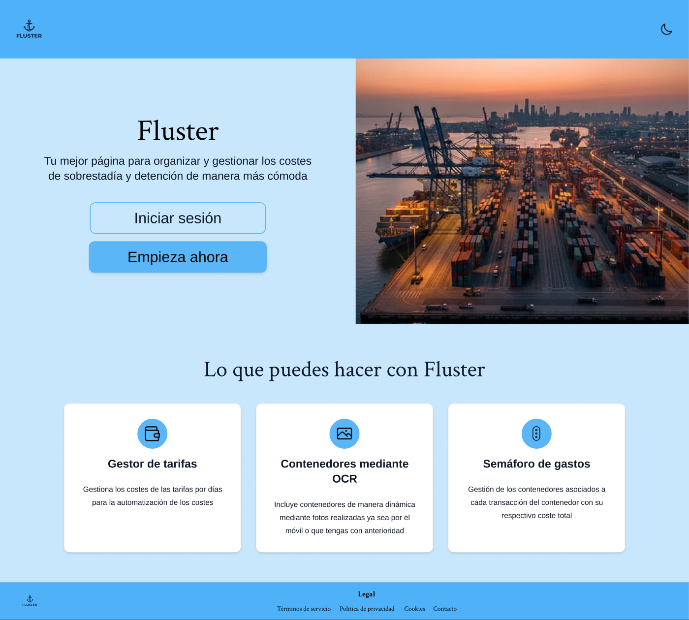
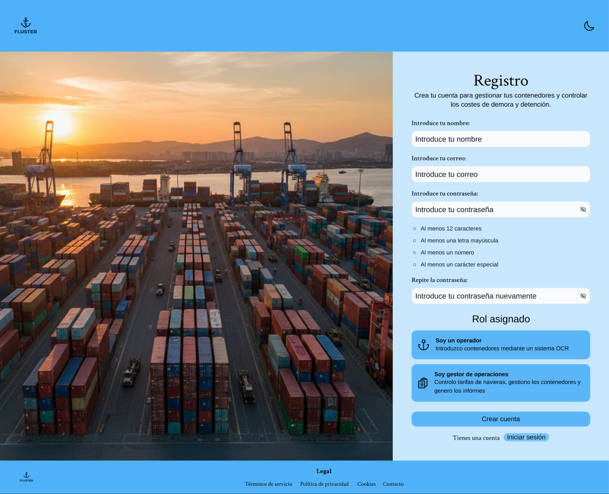
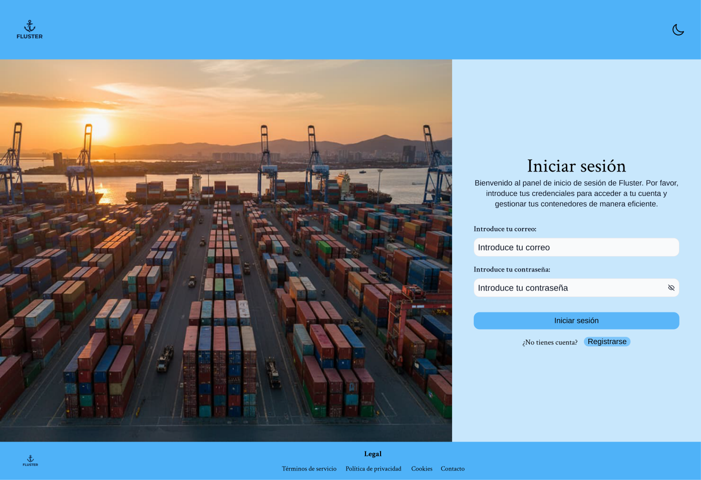
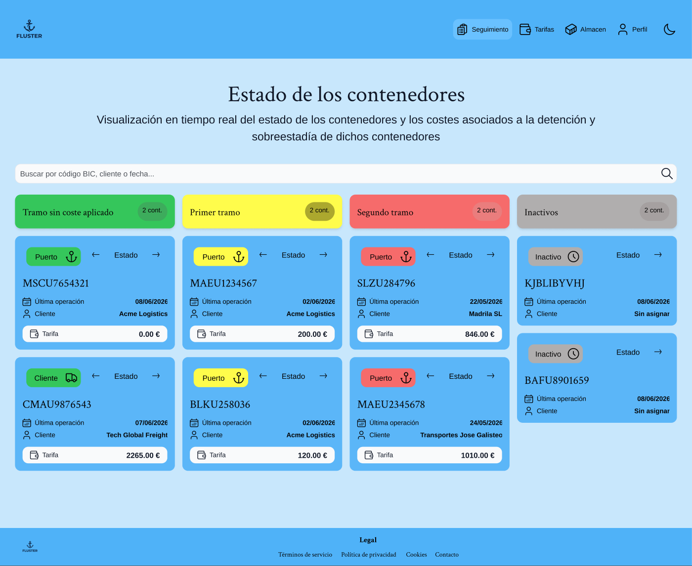
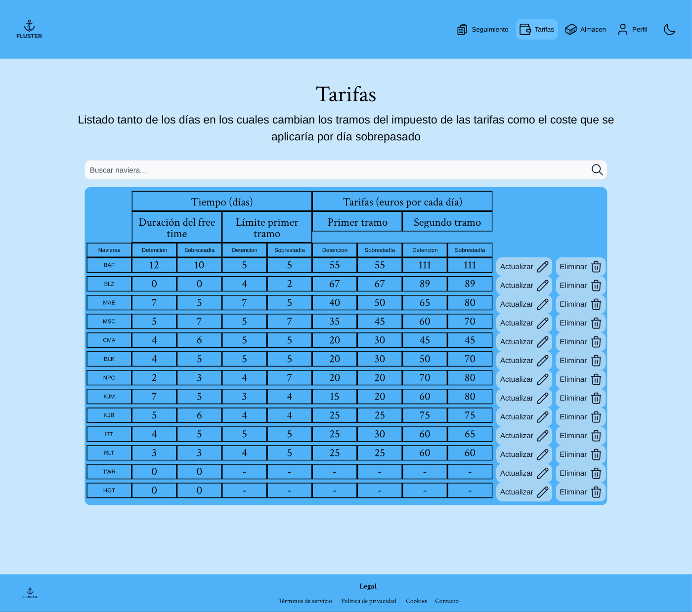
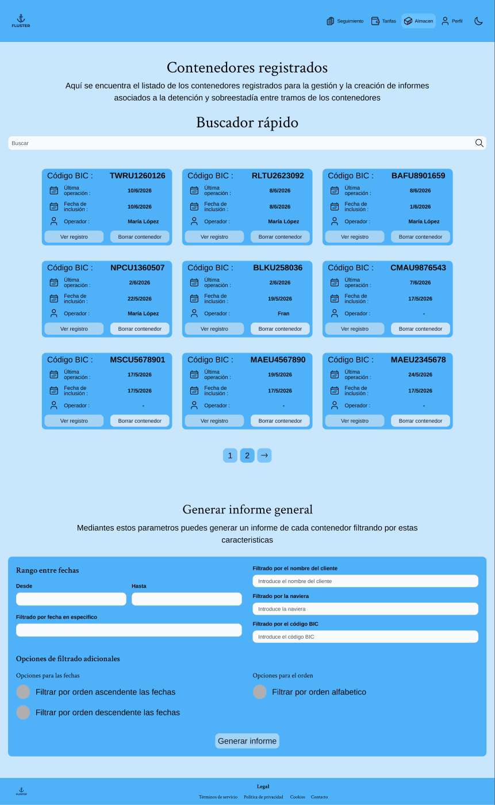
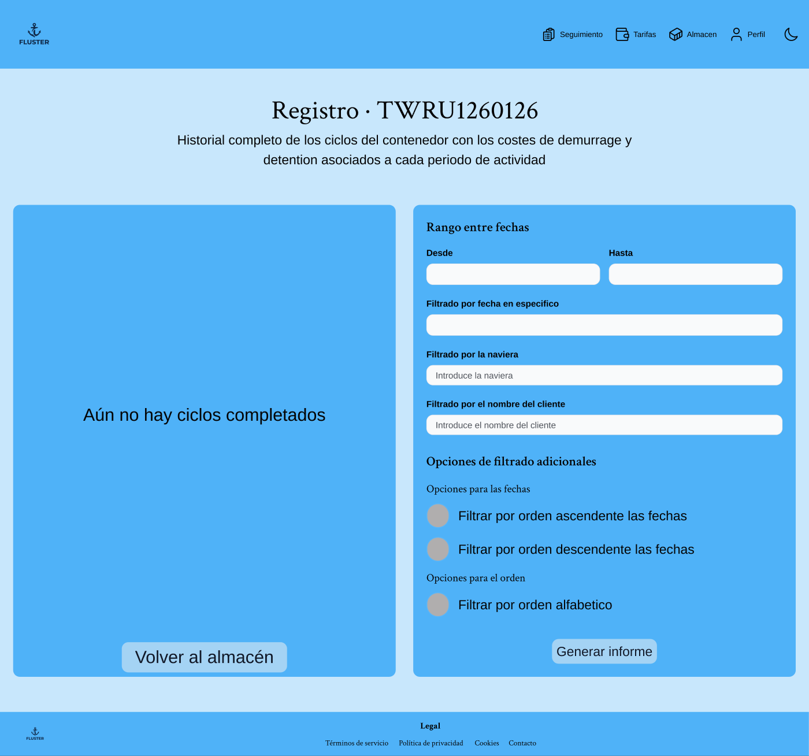
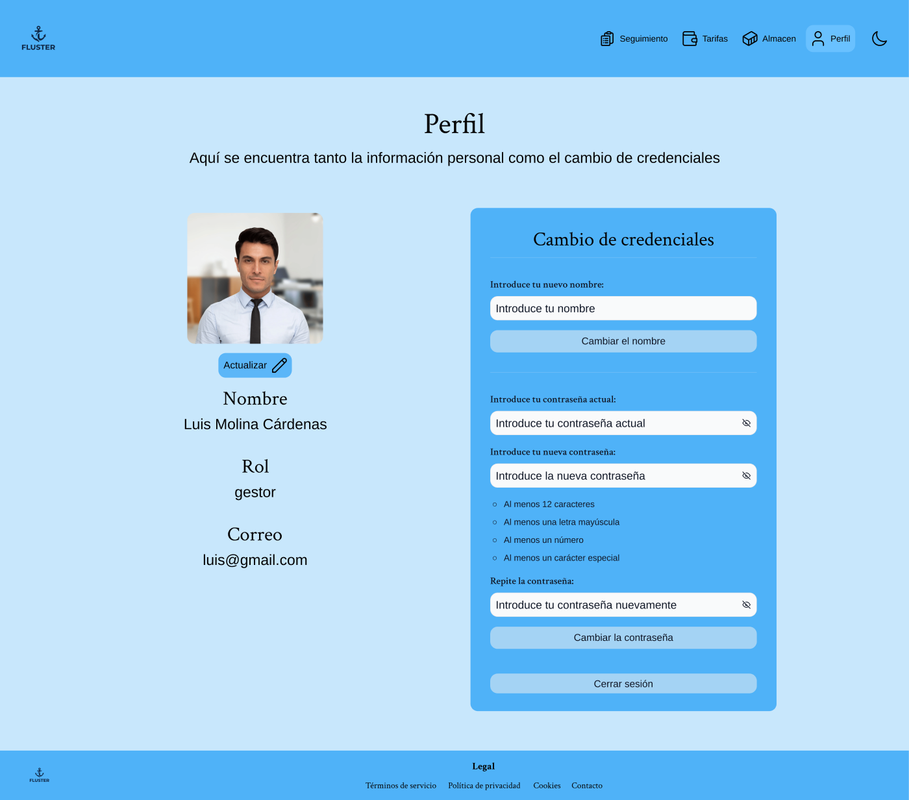

# Flujo completo — Gestor

> Recorrido completo del rol **gestor**, pantalla a pantalla. El gestor **supervisa el
> estado D&D de los contenedores, gestiona las tarifas navieras, el almacén y genera
> informes**. Para cada página se justifica su **coherencia y consistencia visual**, su
> **estructura de la información** y su **alineación con el sistema declarado** en el
> [README principal](../../README.md) (tokens de color §2, tipografía §3, retícula, radio,
> moodboard…).

**Gramática visual compartida** (base de la *consistencia*): cabecera azul
(`--color-primary`) con logo-ancla + navegación (**Seguimiento · Tarifas · Almacén ·
Perfil**) e interruptor de tema; fondo `--color-primary-off`; contenido centrado a máx.
**1224px**; títulos en **Crimson Text** y cuerpo/UI en **Arimo**; tarjetas y paneles con
**radio 12px**, sombra suave y color por *tokens*; footer azul. Solo cambia el contenido.

---

## 1 · Inicio (Home pública)

- **Coherencia visual:** misma cabecera, paleta e *hero* en Crimson Text que el resto del
  producto; tarjetas de capacidades con el radio/sombra estándar.
- **Estructura de la información:** *hero* con propuesta de valor y CTA, y tres tarjetas
  resumen. De lo general (qué es) a la acción (entrar).
- **Según el sistema declarado (README):** *hero* en **Crimson Text** (§3.1) y cuerpo en
  **Arimo** (§3.2); **azul de marca** `--color-primary` (§2.1); estética azul-marítima del
  **moodboard** (§1); tarjetas con **radio 12px** y **escala de 8px** (§3.3).

## 2 · Registro

- **Coherencia visual:** layout partido (imagen + formulario) idéntico a Login; mismos
  inputs, botones y lista de requisitos.
- **Estructura de la información:** alta de cuenta de arriba abajo con requisitos de
  contraseña visibles y selección de **rol** (operador/gestor) antes de crear la cuenta.
- **Según el sistema declarado (README):** tipografía dual **Crimson/Arimo** (§3.1–§3.2);
  inputs/botones con **tokens** y texto auxiliar en `--color-text-subtle` (§2.3); **solo
  variables, nunca hex directos**.

## 3 · Iniciar sesión

- **Coherencia visual:** mismo layout partido y componentes que Registro: un único
  «espacio de acceso».
- **Estructura de la información:** formulario mínimo (correo + contraseña) y enlace a
  Registro. Solo lo necesario para entrar.
- **Según el sistema declarado (README):** mismos **tokens** de input/botón y tipografía
  (§3); **azul de marca** (§2.1) sobre `--color-primary-off`.

## 4 · Semáforo (Estado de los contenedores)

- **Coherencia visual:** es la **materialización de la paleta semántica**: cuatro columnas
  con los colores de estado (verde / amarillo / rojo / gris) sobre las mismas tarjetas y
  tipografía del sistema.
- **Estructura de la información:** tablero **agrupado por nivel de riesgo D&D** (sin coste
  · primer tramo · segundo tramo · inactivo); cada tarjeta muestra el contenedor y su coste
  asociado. Permite leer la situación global **de un vistazo** sin cálculos.
- **Según el sistema declarado (README):** **aplicación directa de los colores semánticos
  de §2.4** — `--color-sin_costes` (verde), `--color-primer_tramo` (amarillo),
  `--color-segundo_tramo` (rojo) e `--color-inactivo` (gris); tarjetas con **radio 12px**,
  tipografía §3 y respeto de la **separación fondo/texto** declarada para cumplir contraste.

## 5 · Tarifas

- **Coherencia visual:** tabla con cabeceras agrupadas y filas alternas que reutilizan los
  colores de estado (amarillo/rojo) para los tramos; acciones «Actualizar/Eliminar» con los
  botones estándar.
- **Estructura de la información:** una fila por **naviera**; columnas agrupadas en *Tiempo
  (días)* (free time, límite de primer tramo) y *Tarifas (€/día)* (sin costes, primer y
  segundo tramo). Buscador arriba. Edición en línea por fila.
- **Según el sistema declarado (README):** los tramos reutilizan **amarillo/rojo de §2.4**;
  cabeceras y celdas con la **escala tipográfica** (§3.3) en **Arimo** (§3.2) para densidad
  de datos, y separadores en `--color-border` (§2.3); botones con tokens.

## 6 · Almacén

- **Coherencia visual:** misma rejilla de tarjetas (`ConjuntoCards`) y buscador que la vista
  de contenedores del operador; el panel inferior «Generar informe» usa los mismos campos e
  inputs.
- **Estructura de la información:** dos bloques — arriba, **contenedores registrados** en
  cuadrícula con buscador; abajo, **«Generar informe general»** con filtros de fecha y
  opciones. Consulta y reporte en una misma página.
- **Según el sistema declarado (README):** **retícula de tarjetas de 1224px** y
  **`--color-secondary`** (§2.2) con **radio 12px**; el panel de informe usa inputs
  tokenizados (§2.3) y tipografía §3, sin romper la gramática del resto de vistas.

## 7 · Historial del contenedor

- **Coherencia visual:** dos paneles (resultados a la izquierda, filtros a la derecha) con
  el mismo radio/sombra; estado vacío («Aún no hay ciclos completados») tipografiado con el
  sistema.
- **Estructura de la información:** título **«Registro · {BIC}»** + subtítulo explicativo;
  a la derecha, filtros (rango de fechas, fecha concreta, naviera, cliente) y opciones de
  orden, con **«Generar informe»**; a la izquierda, los ciclos o el estado vacío y «Volver
  al almacén». Filtros y resultados conviven sin cambiar de pantalla.
- **Según el sistema declarado (README):** paneles `--color-surface`/`--color-secondary`
  con **radio 12px**; el estado vacío en **Crimson Text** (§3.1); inputs de filtro
  tokenizados (§2.3) y **espaciado de 8px** (§3.3) entre campos.

## 8 · Perfil

- **Coherencia visual:** dos columnas (identidad + «Cambio de credenciales») idénticas al
  Perfil de operador y admin salvo los datos.
- **Estructura de la información:** identidad (foto + nombre + rol + correo) separada de las
  acciones de cuenta (cambiar nombre, contraseña con requisitos, cerrar sesión).
- **Según el sistema declarado (README):** **tokens** (§2.3) + tipografía dual (§3) +
  **radio 12px** y escala de 8px; reutiliza los mismos componentes que el resto, prueba del
  **sistema de tokens único**.

---

> **Conclusión:** pese a ser el rol con más pantallas (8), el gestor mantiene la misma
> **gramática visual**, reutiliza patrones (rejilla de tarjetas, paneles de formulario,
> colores de estado §2.4) entre Semáforo, Tarifas, Almacén e Historial, y cumple en cada
> página **lo declarado en el README**, reduciendo la curva de aprendizaje entre vistas.
