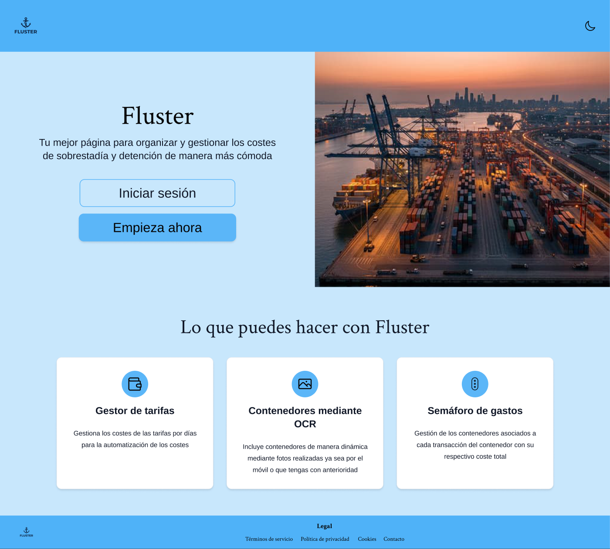
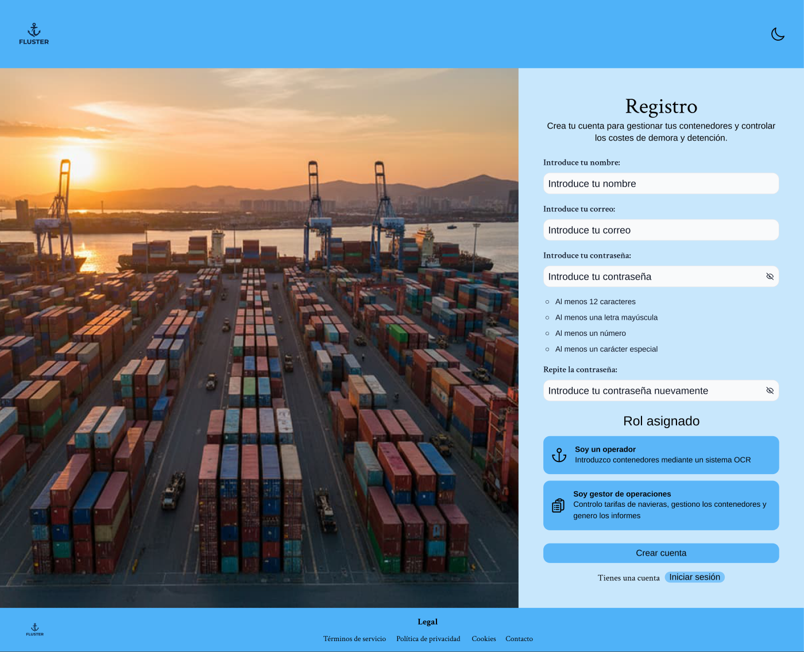
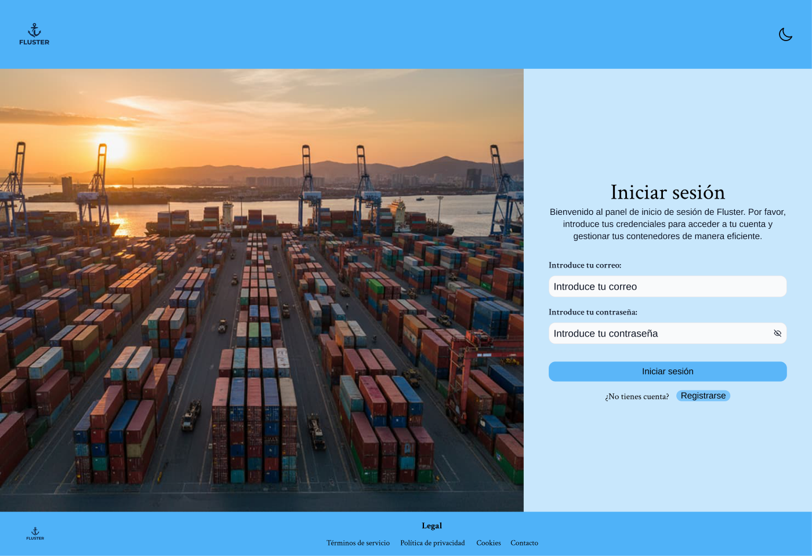
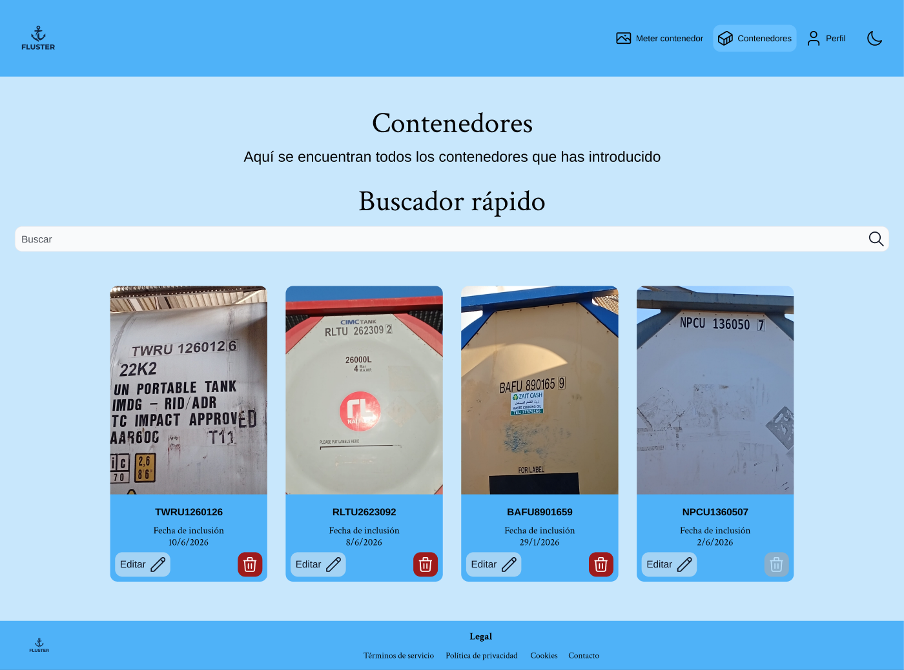
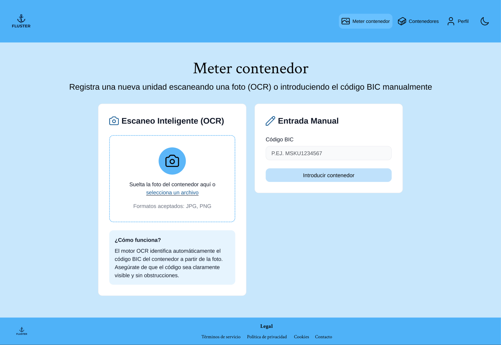
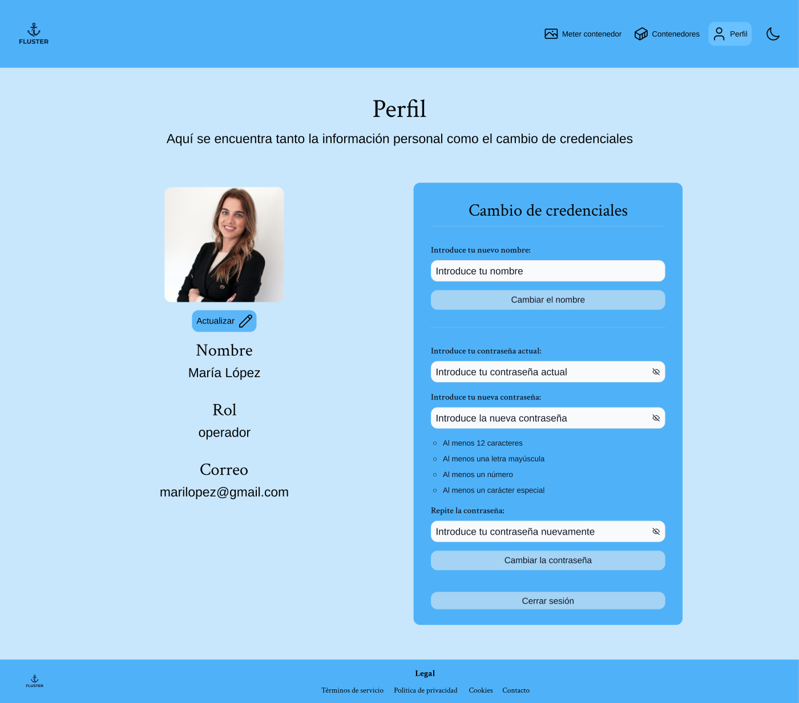

# Flujo completo — Operador

> Recorrido completo del rol **operador**, pantalla a pantalla. El operador es quien
> **da de alta y mantiene los contenedores** que registra. Para cada página se justifica
> su **coherencia y consistencia visual**, su **estructura de la información** y su
> **alineación con el sistema declarado** en el [README principal](../../README.md) (variables
> de color, tipografía, retícula, radio, moodboard…).

**Gramática visual compartida por todas las páginas** (base de la *consistencia*):
cabecera azul (`--color-primary`) con el logo-ancla a la izquierda y navegación +
interruptor de tema a la derecha; fondo `--color-primary-off`; contenido centrado a un
máximo de **1224px**; títulos en **Crimson Text** y cuerpo/UI en **Arimo**; tarjetas y
paneles con **radio 12px**, sombra suave y color exclusivamente por *variables*; footer azul
con enlaces legales. Lo único que cambia entre pantallas es el contenido.

---

## 1 · Inicio (Home pública)

- **Coherencia visual:** misma cabecera, paleta azul e *hero* en Crimson Text; las tres
  tarjetas «Lo que puedes hacer con Fluster» usan el mismo radio y sombra que las del área
  privada, anticipando el lenguaje del producto.
- **Estructura de la información:** patrón *hero* (titular + subtítulo + CTA «Iniciar
  sesión / Empieza ahora») y, debajo, tres tarjetas de capacidades. Jerarquía descendente:
  primero la propuesta de valor, luego la acción.
- **Según el sistema declarado (README):** *hero* en **Crimson Text** y cuerpo/CTA
  en **Arimo**; **azul de marca** `--color-primary` sobre `--color-primary-off`;
  tarjetas con **radio 12px** y **escala de 8px**. La estética azul-marítima responde
  directamente al **moodboard**.

## 2 · Registro

- **Coherencia visual:** layout **partido** (imagen de puerto a la izquierda, formulario a
  la derecha) idéntico al de Login; inputs, botones y tipografía comparten estilos.
- **Estructura de la información:** formulario de arriba abajo (nombre → correo →
  contraseña **con los requisitos visibles** → repetir) y, al final, **«Rol asignado»**
  para elegir operador o gestor antes de «Crear cuenta». Mostrar los requisitos *antes* de
  fallar es prevención de errores.
- **Según el sistema declarado (README):** tipografía dual **Crimson/Arimo**;
  inputs y botones con **variables** de color, y los requisitos en `--color-text-subtle`; cumple la norma del README de **usar solo variables, nunca hex directos**.

## 3 · Iniciar sesión

- **Coherencia visual:** mismo layout partido y los mismos componentes de input/botón que
  Registro; refuerza la idea de un único «espacio de acceso».
- **Estructura de la información:** formulario mínimo (correo + contraseña) con enlace
  secundario a Registro. Solo lo imprescindible para entrar.
- **Según el sistema declarado (README):** mismas **variables** de input/botón y tipografía que Registro; **azul de marca** y fondo `--color-primary-off`; el botón aplica
  el patrón con *spinner* de carga descrito en el sistema.

## 4 · Contenedores

- **Coherencia visual:** cabecera con la sección «Contenedores» marcada como activa;
  rejilla de tarjetas (`ConjuntoCards`) centrada a 1224px, con tarjetas `--color-secondary`
  de radio 12px iguales a las de semáforo/usuarios.
- **Estructura de la información:** título + subtítulo, **buscador rápido** y la cuadrícula
  de los contenedores del operador. Cada tarjeta agrupa foto, código BIC, fecha de
  inclusión y acciones (editar / eliminar). Cuadrícula fluida que refluye 3→2→1.
- **Según el sistema declarado (README):** tarjetas en **`--color-secondary`** con
  **radio 12px** sobre la **retícula de 1224px**; código BIC y fechas en **Arimo**
  para legibilidad del dato; títulos en **Crimson**.

## 5 · Meter contenedor

- **Coherencia visual:** dos paneles blancos simétricos con el mismo radio y sombra;
  iconos y tipografía consistentes con el resto de la app.
- **Estructura de la información:** **dos vías en paralelo** — «Escaneo Inteligente (OCR)»
  (zona de subida + ayuda «¿Cómo funciona?») y «Entrada Manual» (campo BIC). Ofrecer ambas
  en una sola pantalla elimina decisiones previas y se adapta a cada situación.
- **Según el sistema declarado (README):** paneles **`--color-surface`** con **radio 12px**
  y **sombra** de la escala declarada; iconos SVG con `currentColor` (heredan el color del
  texto, coherentes con el tema); tipografía.

## 6 · Perfil

- **Coherencia visual:** dos columnas (identidad a la izquierda, panel «Cambio de
  credenciales» a la derecha) con los mismos paneles y campos; idéntico al Perfil de gestor
  y admin salvo los datos del usuario.
- **Estructura de la información:** la **identidad** (foto + nombre + rol + correo) se
  separa de las **acciones de cuenta** (cambiar nombre, cambiar contraseña con requisitos,
  cerrar sesión). Primero se lee, después se edita.
- **Según el sistema declarado (README):** paneles y campos con **variables**,
  tipografía dual, **radio 12px** y **escala de 8px**; reutiliza exactamente los
  mismos componentes que el resto, prueba del **sistema de variables único**.

---

> **Conclusión:** las seis páginas comparten una **gramática visual única** (cabecera,
> retícula de 1224px, tipografía dual Crimson/Arimo, tarjetas y paneles definidos por variables),
> ordenan la información **de lo general a lo accionable** y cumplen, una a una, **lo
> declarado en el README** (colores, tipografía, radios y espaciado), haciendo el
> recorrido predecible y verificable.
